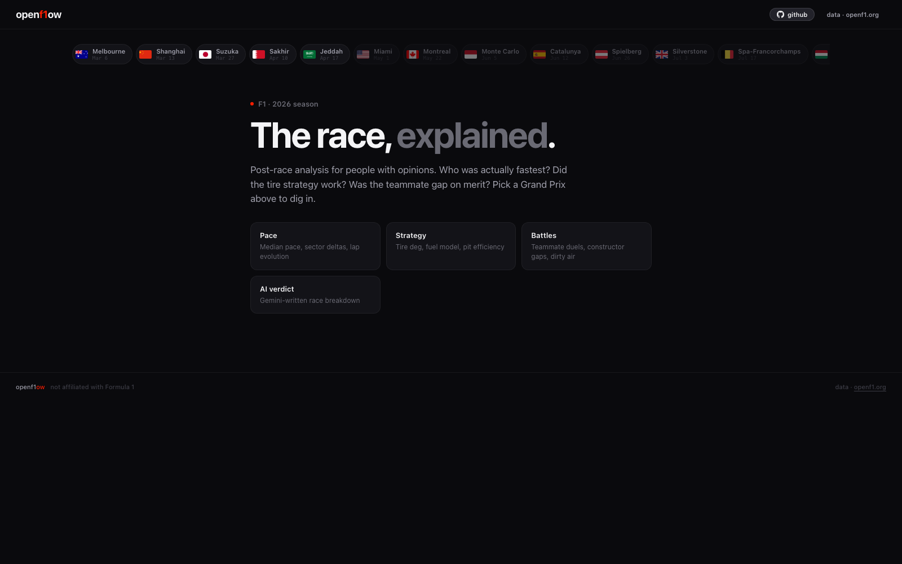
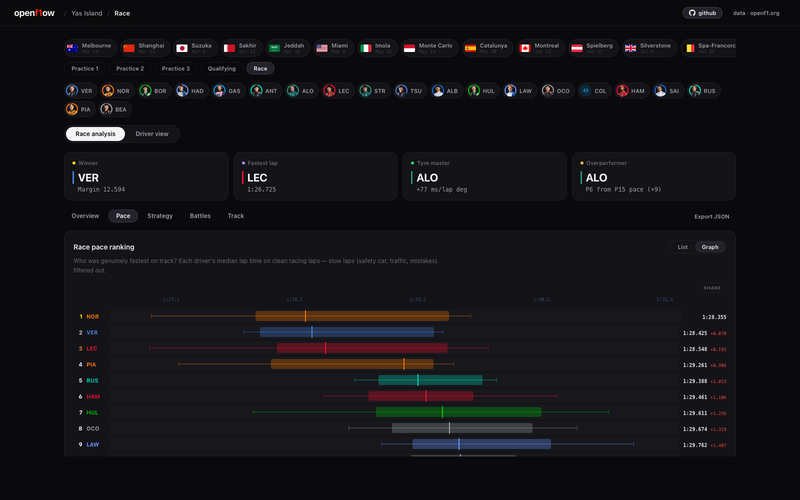
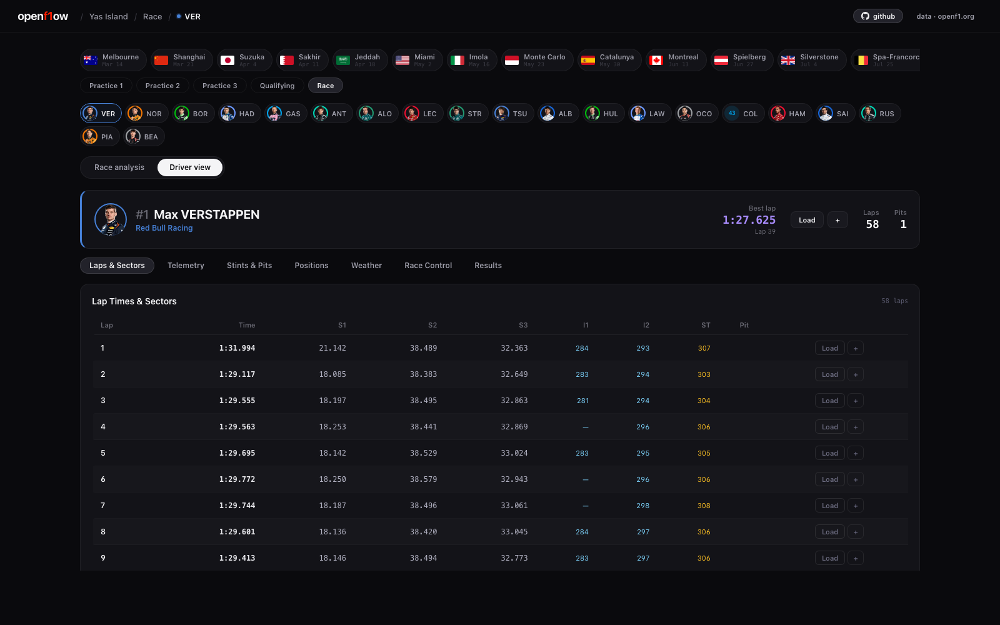
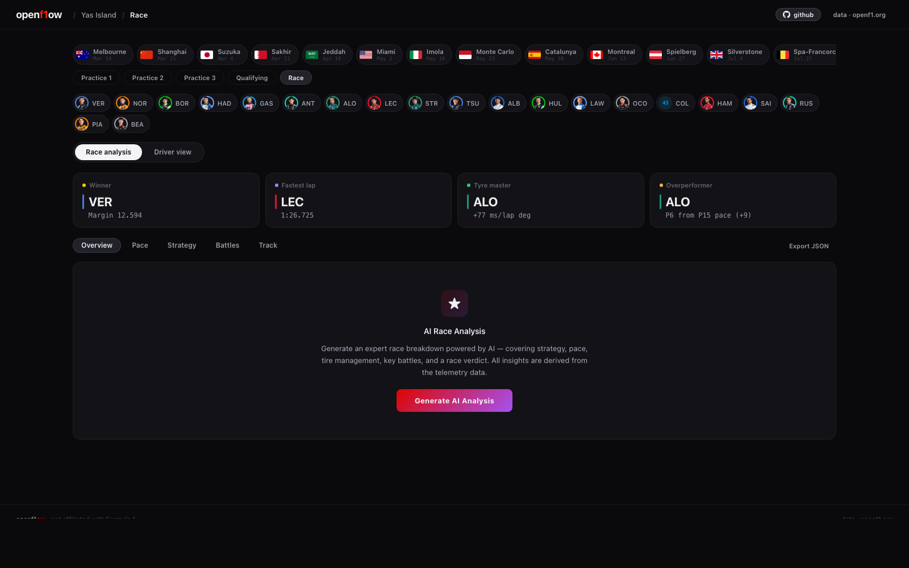
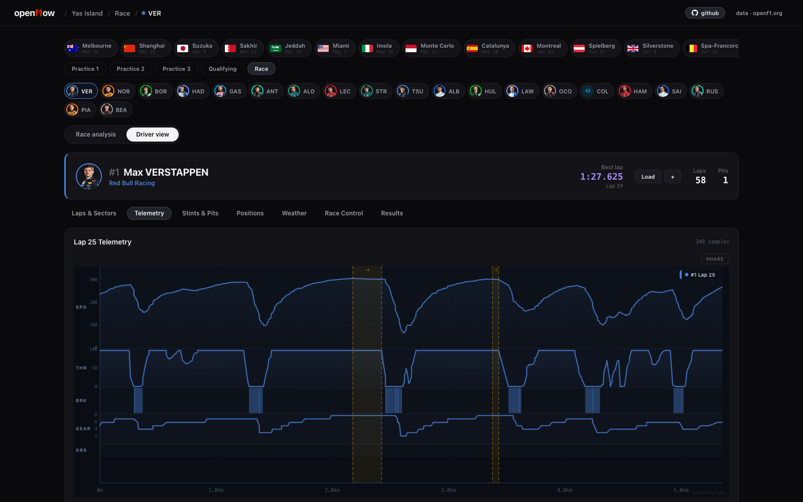

# OpenF1ow

Formula 1 telemetry dashboard and race analysis platform powered by the [OpenF1 API](https://openf1.org).

**Live:** [www.openf1ow.com](https://www.openf1ow.com) · **Source:** [github.com/vassilispapadop/openf1ow](https://github.com/vassilispapadop/openf1ow)

## Screenshots

<!-- Drop images into docs/images/ with the names below and they'll render here. -->

| Home | Race Analysis |
|---|---|
|  |  |

| Driver View | AI Race Analysis |
|---|---|
|  |  |


*Single-lap telemetry — speed, throttle, brake, gear, DRS.*

## Features

### Driver View
- **Lap-by-lap data** with sector times, speeds, and pit stop info
- **Live telemetry** — speed, throttle, brake, gear, DRS traces per lap
- **Multi-driver comparison** — overlay telemetry from different drivers/laps
- **Position tracking** and race control messages

### Race Analysis
- **Race Pace Ranking** — median pace with box plot distributions and consistency metrics
- **Sector Analysis** — sector deltas, speed traps, theoretical best laps, consistency heatmap
- **Tire Degradation** — fuel-corrected deg/lap per stint, compound comparison summary
- **Constructor Pace** — team-level aggregation with intra-team driver gap analysis
- **Teammate Battles** — head-to-head lap wins and pace comparison
- **Pit Stop Efficiency** — crew rankings, pit window timeline
- **Dirty Air Analysis** — traffic heatmap, time loss quantification, gap vs loss scatter
- **Weather Correlation** — temperature vs pace scatter, driver adaptability
- **Fuel Model** — estimated fuel load curve and cumulative time gain
- **Scatter plots** across all tabs for deeper correlation analysis

### AI Race Analysis
- **Groq-powered** natural language race breakdown (Llama 3.3 70B)
- Covers strategy, battles, tire management, and race verdict
- Streamed in real-time with markdown rendering

### Other
- **URL-based navigation** — shareable deep links, browser back/forward
- **JSON export** — download race summary data for external analysis
- **API response caching** — instant navigation on revisit
- **Hover tooltips** on all charts and graphs

## Tech Stack

| Layer | Technology |
|-------|-----------|
| Frontend | React 18 + TypeScript + Vite 6 + React Router 7 |
| Hosting | Cloudflare Workers + Pages |
| Data | [OpenF1 API](https://openf1.org) |
| AI | Groq API, `llama-3.3-70b-versatile` (via Cloudflare Worker proxy) |
| Charts | Custom canvas rendering (no chart library) |

## Getting Started

```bash
cd f1-app
npm install
npm run dev
```

### Environment Setup

For AI analysis, set the Groq API key as a Cloudflare Worker secret:

```bash
npx wrangler secret put GROQ_API_KEY
# optional: override the default model
npx wrangler secret put GROQ_MODEL
```

### Deploy

```bash
npm run deploy
```

Or push to `master` — Cloudflare auto-deploys via GitHub integration.

## Project Structure

```
f1-app/
  src/
    App.tsx                    # Router + app shell
    RaceAnalysis.tsx           # Race analysis — all analysis tabs and charts
    pages/
      HomePage.tsx             # Landing page
      DriverPage.tsx           # Per-driver telemetry view
      AnalysisPage.tsx         # Full race analysis view
    layouts/
      SessionLayout.tsx        # Shared header/selectors/footer shell
    contexts/
      SessionContext.tsx       # Meeting/session/driver state
    components/
      AIAnalysis.tsx           # AI-powered race narrative (Groq streaming)
      analysis/                # Individual analysis modules (pace, sectors, ...)
      shell/                   # Header, Footer, SelectorBar, DriverGrid, ...
    lib/
      buildAnalysisSummary.ts  # Compact race summary builder for LLM
      raceUtils.ts             # Shared math (median, linear regression, ...)
      styles.ts                # Shared style constants
      types.ts                 # TypeScript interfaces (Driver, Lap, Stint, ...)
    server/
      index.ts                 # Cloudflare Worker — Groq API proxy
  wrangler.jsonc               # Cloudflare deployment config
```

## License

MIT
